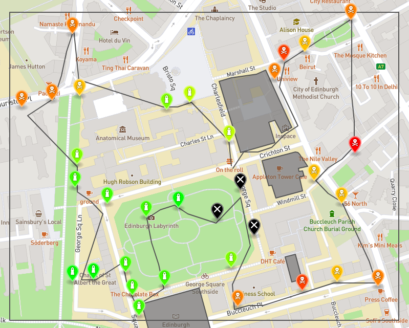

# Informatics Large Practical

The requirements for this project were to design a program that, when given a set of checkpoints and no-fly-zones, plans a route that visits all checkpoints and returns to the origin point within the lowest amount of moves. The program outputs the path in JSON format which can be visualised with an external tool.

Below are some example paths my code generated:

